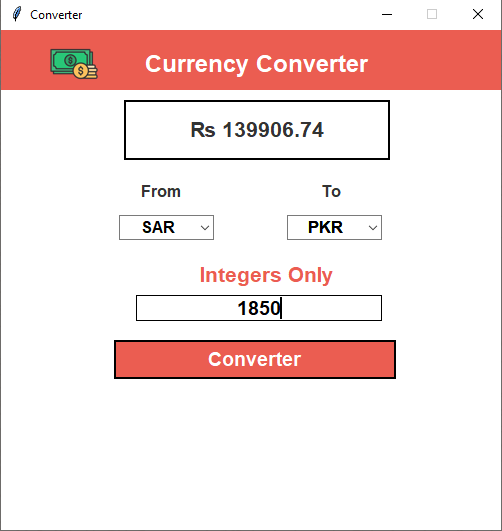

# Currency Converter GUI App

A simple desktop application built using Python and Tkinter that lets you convert between popular currencies in real time using [RapidAPI's Currency Converter API](https://rapidapi.com/).

---

## Features

- Real-time currency conversion
- Supports 13 major currencies
- Clean and responsive Tkinter GUI
- Displays currency symbols (₹, $, €, ₨, etc.)
- Uses **RapidAPI** for exchange rate data

---

## Setup & Installation

### 1. Clone the Repository

```bash
git clone https://github.com/yourusername/currency-converter.git
cd currency converter
```

### 2. Install Required Dependencies

Make sure you have Python 3.7 or above installed.

```bash
pip install pillow requests
```

> `tkinter` comes pre installed with most Python distributions. If not, reinstall Python and make sure to check the **“tcl/tk”** option during installation.

---

### 3. API Key Setup (RapidAPI)

This app uses the [Currency Converter API](https://rapidapi.com/apilayernet/api/currency-converter18) from RapidAPI for real-time exchange rates.

#### Steps:

1. Go to [RapidAPI](https://rapidapi.com/) and log in or sign up.
2. Search for **Currency Converter API** and subscribe to a free plan.
3. Copy your `X-RapidAPI Key`.
4. Open the `currency_converter.py` file and locate this section:

```python
headers = {
    "X-RapidAPI-Key": "your-api-key-here",
    "X-RapidAPI-Host": "currency-converter18.p.rapidapi.com"
}
```

5. Replace `"your_api_key_here"` with your actual API key.

---

### 4. Run the App

Once dependencies and the API key are set up:

```bash
python currency_converter.py
```

---

## Supported Currencies

The application supports conversion between the following 13 major currencies:

| Code | Currency Name        | Symbol |
|------|----------------------|--------|
| USD  | US Dollar            | $      |
| PKR  | Pakistani Rupee      | ₨      |
| EUR  | Euro                 | €      |
| INR  | Indian Rupee         | ₹      |
| TRY  | Turkish Lira         | ₺      |
| CAD  | Canadian Dollar      | CAD    |
| GBP  | British Pound        | £      |
| CNY  | Chinese Yuan         | ¥      |
| SAR  | Saudi Riyal          | SR     |
| AUD  | Australian Dollar    | AUD    |
| HKD  | Hong Kong Dollar     | HK $   |
| AED  | UAE Dirham           | د.إ     |
| IQD  | Iraqi Dinar          | ع.د     |
| IRR  | Iranian Rial         | ﷼      |

---

## UI Preview

> 

---

## Contributing

Have an idea to improve the app or want to add more currencies?  
Feel free to fork the repo, submit a pull request, or open an issue!
